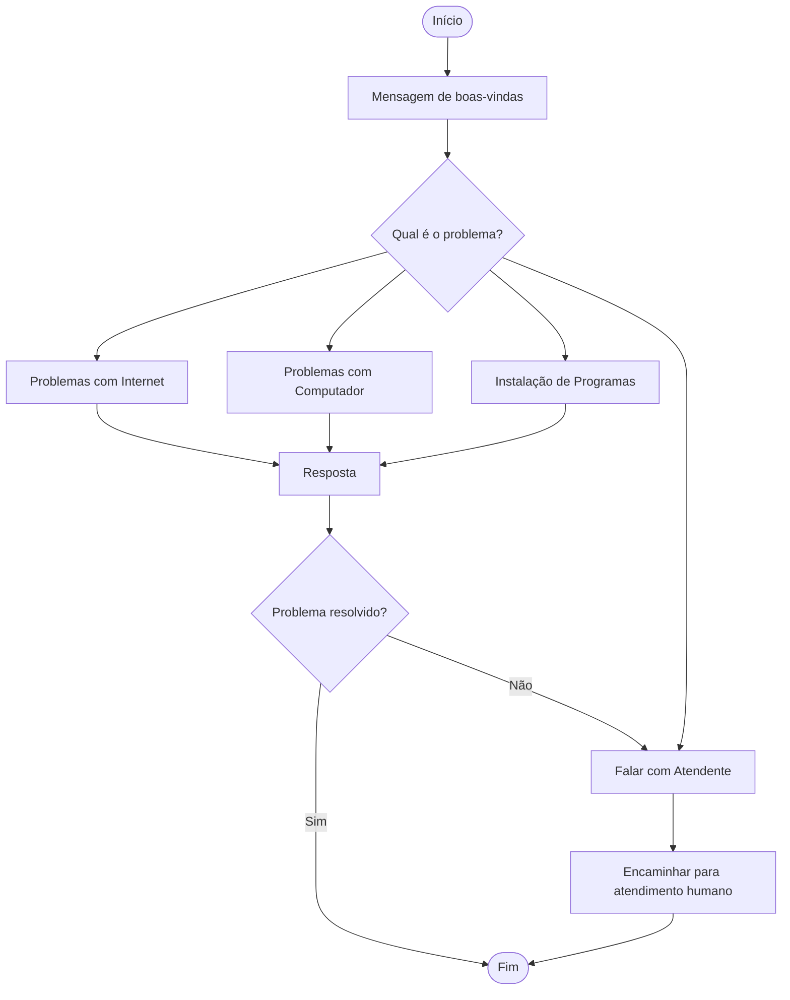

# 🔄 Fluxo de Conversa

## Objetivo

O fluxo de conversa define como o TechHelp Copilot conduz a interação com o usuário, desde o primeiro contato até a resolução do problema ou o encaminhamento para atendimento humano.

---

# Fluxo Principal

---

# Etapas da Conversa

## 1️⃣ Boas-vindas

Ao iniciar a conversa, o usuário recebe uma mensagem de recepção.

**Exemplo**

> Olá! 👋
>
> Eu sou o TechHelp Copilot.
>
> Estou aqui para ajudar você com dúvidas técnicas.
>
> Como posso ajudar hoje?

---

## 2️⃣ Identificação da necessidade

O copiloto identifica o assunto da conversa utilizando frases de gatilho (Trigger Phrases).

Exemplos:

- Minha internet caiu
- Meu computador está lento
- Preciso instalar o Python
- Quero falar com um atendente

---

## 3️⃣ Seleção do tópico

Após identificar a intenção do usuário, o Copilot direciona a conversa para o tópico correspondente.

Cada tópico possui:

- Frases de gatilho
- Fluxo próprio
- Respostas personalizadas

---

## 4️⃣ Geração da resposta

Dependendo da situação, o Copilot poderá:

- Utilizar respostas previamente definidas;
- Gerar respostas utilizando IA Generativa;
- Solicitar mais informações ao usuário.

---

## 5️⃣ Encerramento

Ao final da conversa, o usuário poderá:

- Confirmar que o problema foi resolvido;
- Solicitar outro atendimento;
- Ser encaminhado para um atendente humano.

---

# Benefícios do Fluxo

- Conversas organizadas.
- Fácil manutenção.
- Melhor experiência para o usuário.
- Respostas mais precisas.
- Possibilidade de expansão futura.